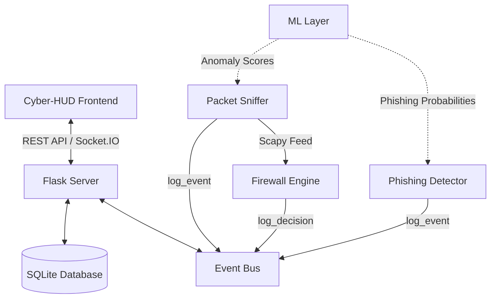

# 🛡️ NetGuard: Unified Cyber Security HUD & ML Threat Engine

NetGuard is an advanced, enterprise-ready unified security dashboard that integrates a **real-time network packet sniffer** (with machine learning anomaly detection), a **phishing page analyzer**, and an **interactive rule-based firewall simulator**—all presented via a premium glassmorphic **Cyber-HUD dashboard interface**.

---

## 🚀 Key Features

*   **🔒 Live/Synthetic Firewall Engine**: Priority-based rule evaluation supporting CIDR subnets, port ranges, and protocol matches with real-time Sankey flow visualizations.
*   **📡 Scapy Packet Capture**: Multi-threaded packet capturing utilizing BPF filters and signature detection rules targeting SYN floods, port scans, DNS tunneling, and IP blacklists.
*   **🤖 ML Anomaly Pipeline**: Incorporates an `IsolationForest` out-of-the-box model scoring rolling traffic metrics (packet rate, entropy, protocol mixtures) to flag deviations.
*   **🎣 Phishing Page Lab**: Multi-stage URL scans checking redirect histories, TLS/SSL chains via pyOpenSSL, domain ages via python-whois, and BeautifulSoup content parsing (brand mismatch, obfuscated inline JavaScript, off-domain forms).
*   **🕸️ Cyber-HUD Real-Time Console**: Real-time logging console using Socket.IO, displaying JSON packet details dynamically, and supporting full CRUD/reordering of firewall rules.

---

## 📐 System Architecture



---

## 🛠️ Tech Stack & Requirements

*   **Backend Framework**: Flask, Flask-SocketIO (Eventlet async driver)
*   **Database ORM**: SQLAlchemy 2.0 (SQLite local storage)
*   **Network & Security Parsing**: Scapy, PyOpenSSL, python-whois, BeautifulSoup4
*   **Machine Learning**: Scikit-Learn, Pandas, NumPy, Joblib
*   **Frontend Visuals**: Vanilla CSS (glassmorphism/glow themes), D3.js (Sankey Flow)

---

## 🏁 Quick Start Guide

### 1. Setup & Installation
Ensure you have Python 3.12+ installed. Clone the repository and initialize the virtual environment:
```bash
# Set up virtual environment
python -m venv .venv
source .venv/bin/activate  # On Windows: .venv\Scripts\activate

# Install dependencies
pip install -r netguard/requirements.txt
```

### 2. Train the Machine Learning Classifier
You can train the IsolationForest model for the packet sniffer using synthetic normal profiles:
```bash
python -m netguard.ml.training.train_anomaly_model
```

### 3. Launch the Security HUD Server
```bash
python -m netguard.dashboard.app
```
Access the Cyber-HUD dashboard at `http://127.0.0.1:5000/`.

---

## 🧪 Running the Test Suite
NetGuard maintains a comprehensive suite of 24 unit tests covering every package component. Run them using:
```bash
python -m unittest discover -s netguard/tests/
```
